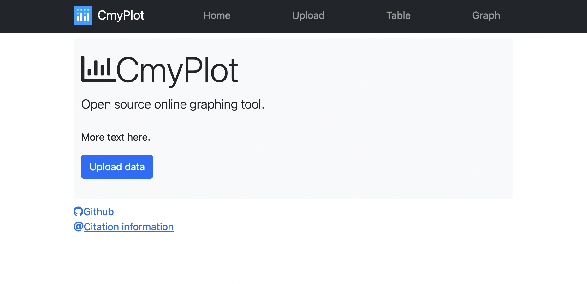
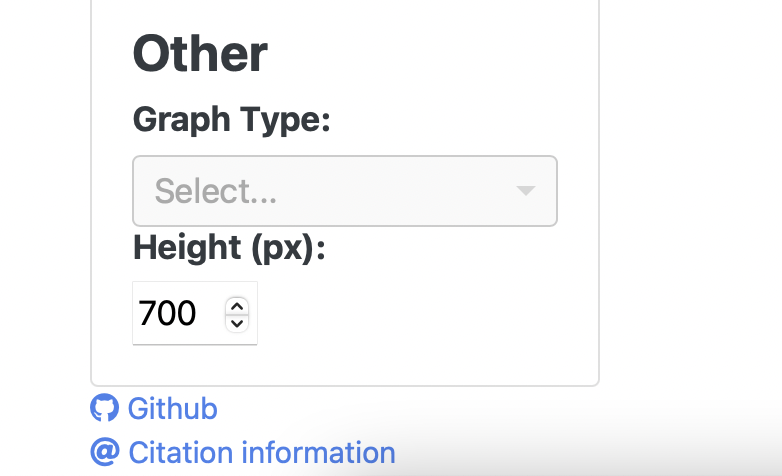
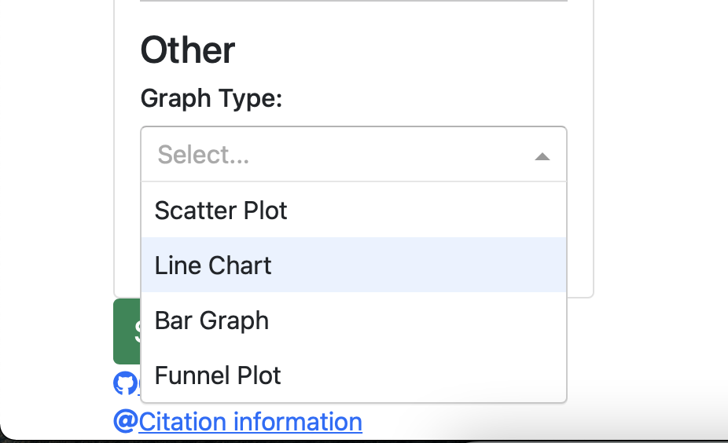
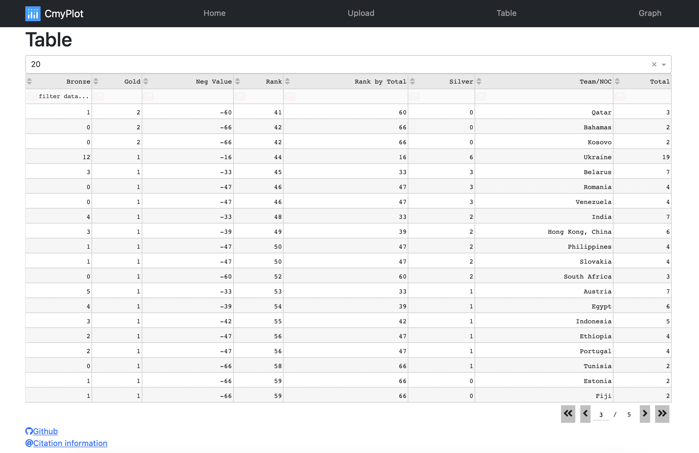
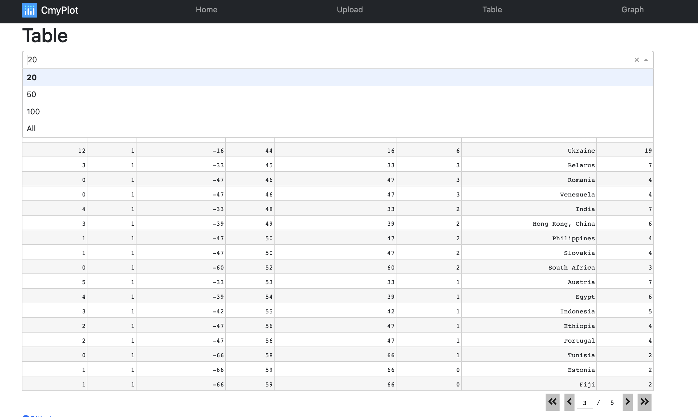
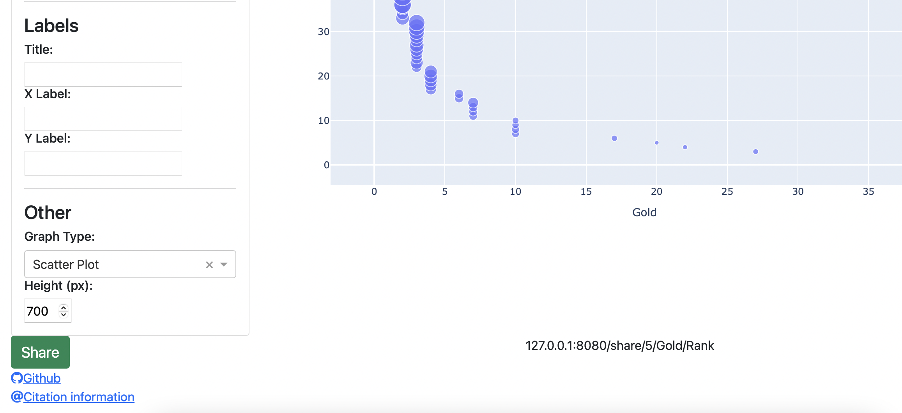

# New Features and Enhancements ✨

* We have changed the UI in Phase 2. 
  <table>
    <tr>
        <th>Phase 1</th>
        <th>Phase 2</th>
    </tr>
    <tr>
        <td>
        
        </td>
        <td>
            UI has been changed in Phase 2 
            
        </td>
    </tr>
  </table>
* In Phase 1, the only graph option available was Scatter Plot. In Phase 2, we have expanded the graph options to line chart, bar graph and funnel plot.
  <table>
    <tr>
        <th>Phase 1</th>
        <th>Phase 2</th>
    </tr>
    <tr>
        <td>The only graph option available was scatter plot
             
            
        </td>
        <td>The available graph options are scatter plot, line char, bar graph and funnel plot. 
             
            
        </td>
    </tr>
  </table>
* In Phase 2, we have added a code formatter named Black in addition to a style checker Flake8 which was added in Phase 1 in GitHub Action Workflow
* In this phase, we have provided user the facility to choose the number of rows to view in a table as opposed to the Phase 1 release where the user could view only 20 rows at a time.
  <table>
     <tr>
            <th>Phase 1</th>
            <th>Phase 2</th>
    </tr>
    <tr>
       <td>
        Only 20 rows could be viewed at a time.
         
        
        </td>
        <td>
        We have given the option to choose the number of rows that the user wants to view at any time.
         
        
        </td> 
    </tr>
  </table>
* We have also added a production server called waitress, and we have deployed the application on Heroku using that server: https://cmyplot.herokuapp.com
* We have also provided the facility to share dashboards containing one graph using a sharable URL.
  <table>
     <tr>
            <th>Phase 1</th>
            <th>Phase 2</th>
     </tr>
    <tr>
        <td>
            Facility for sharing the graph was not provided to the users. 
        </td>
        <td>
            We have provided the facility to share dashboards containing one graph using a sharable URL.
             
        </td>
    </tr>
  </table>
  