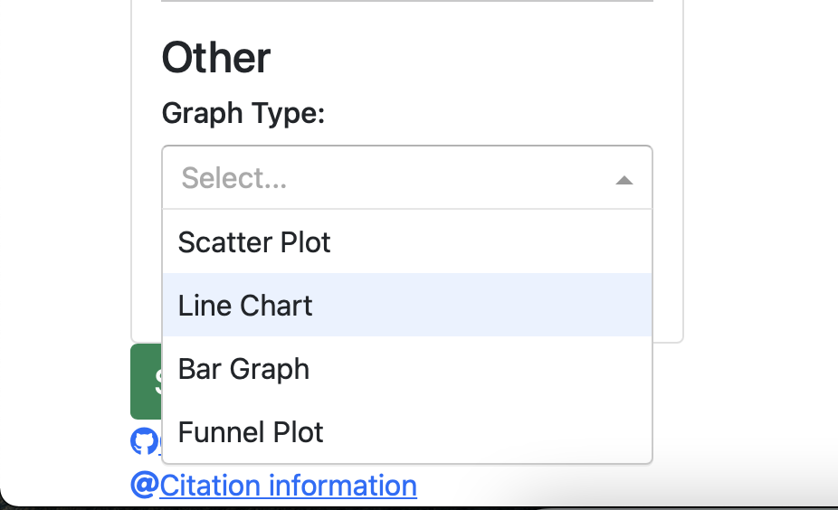

# New Features and Enhancements ✨

<table>
    <tr>
        <th>Phase 1</th>
        <th>Phase 2</th>
    </tr>
    <tr>
        <td>
        
        </td>
        <td>
            UI has been changed in Phase 2 
            
        </td>
    </tr>
    <tr>
        <td>The only graph option available was scatter plot
             
            
        </td>
        <td>The available graph options are scatter plot, line char, bar graph and funnel plot. 
             
            
        </td>
    </tr>
    <tr>
        <td>
        In Phase 1, only style checker, Flake8, was used in the GitHub action workflow.
        </td>
        <td>
        In Phase 2, we have added a code formatter called Black in addition to Flake8. We reformatted the old code using Black since it was not compatible with Black standards.   
        </td>
    </tr>
    <tr>
        <td>
        Only 20 rows could be viewed at a time.
         
        
        </td>
        <td>
        We have given the option to choose the number of rows that the user wants to view at any time.
         
        
        </td>
    </tr>
    <tr>
        <td>
        In Phase 1, no production server was used.
        </td>
        <td>
        In Phase 2, we added a production server called waitress and we deployed the application on heroku using that server.
         
        <a href="https://cmyplot.herokuapp.com">Deployed application</a>
        </td>
    </tr>
    <tr>
        <td>
            Facility for sharing the graph was not provided to the users. 
        </td>
        <td>
            We have provided the facility to share dashboards containing one graph using a sharable URL.
             
        </td>
    </tr>
</table>