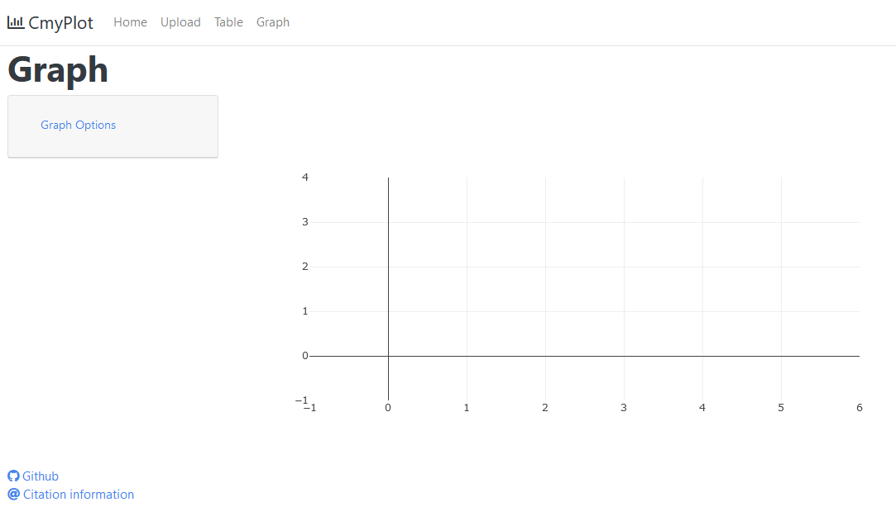

# CmyPlot  
**Data Visualisation Web App** 

## Why Data Visualization?

With enormous data in hand you would always want to visualize it for good understanding and better clarity with minimal efforts. 

As the famous saying goes - `"The greatest value of visualization is when it forces us to notice what we never expected to see"` - John W. Tukey

`CmyPlot` is a web app that provides interface for uploading a csv data file and convert it into Tables and intresting graphs with one click

- ## Built with

  
  
  

- **Language used:** Python
- **Libraries used:** Flask, Plotly, Dash
## Would like to have a quick preview?
https://user-images.githubusercontent.com/65619749/134620802-5fac9f0e-d697-49df-876c-3f5ff7d86e38.mp4

## Quick look:

<table border="2" bordercolorlight="#b9dcff" bordercolordark="#006fdd">

  <tr style="background: #010203 ">
    <td valign="left"> 
        
 hello 
        

      
    </td>
    <td valign="left"> 
      <a href="./docs/images/pre_upload.png">
             </td>
      </a>
    </td>
  
  <tr style="background: #010203;"> 
    <td valign="left"> 
      
    </td>

  </tr> 
  
  <tr style="background: #010203;"> 
     <td valign="left"> 
      
    </td> 
    <td valign="left"> 
      
    </td>

  </tr> 

  <tr style="background: #010203;"> 
<td valign="left"> 
      
    </td>
    <td valign="left"> 
      
    </td>
  </tr> 
 </table>
   
## Getting started:

  - ### Prerequisite:
      - Download [Python3.x](https://www.python.org/downloads/) on your system.

   - ### Installation:
      E.g If you downloaded `Python 3.9.7` above, then

      **Steps to setup virtual environment**
     - Create a virtual environment:

        `python3.9 -m venv project1_env`
    
     - Activate the virtual environment: 

        `source project1_env/bin/activate`
    
     - Build the virtual environment:(must be present in [project directory](./))

        `pip install -r requirements.txt`

  - ### Run Instructions

     **To run/test the site locally:**

     - Clone [this (CmyPlot) github repo](https://github.com/bradley-erickson/CmyPlot).

     - Navigate to [project directory](./).
  
     - Run `python src/index.py`

     - Site will be hosted at:
       `http://127.0.0.1:8085/`
     - [Refer the demo video to understand usage of this app.](https://user-images.githubusercontent.com/65619749/134620802-5fac9f0e-d697-49df-876c-3f5ff7d86e38.mp4)
## Roadmap

## Team Members
[Bradley Erickson](https://github.com/bradley-erickson)
[Aakriti](https://github.com/aakriti0fnu)
[Sharath Kumar](https://github.com/sharathKV)
[AshwinKumarMuniswamy](https://github.com/AshwinKumarMuniswamy)
[Jainam](https://github.com/j-08-shah)

