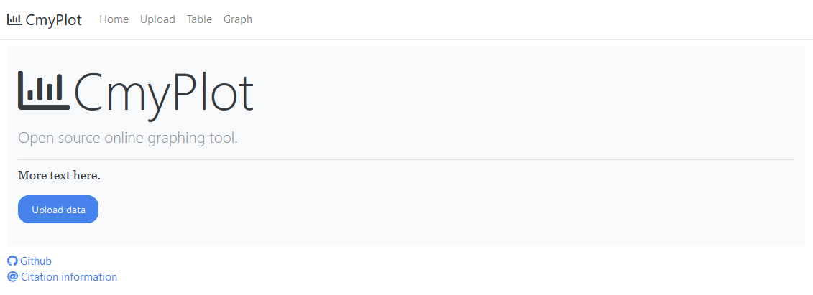
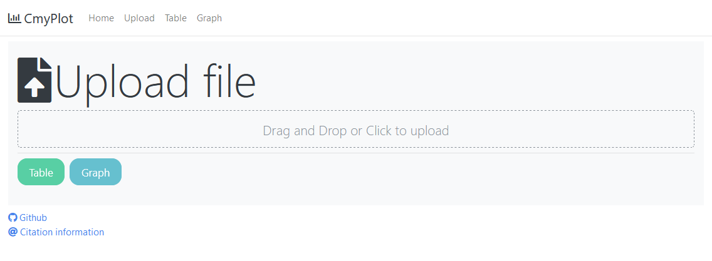
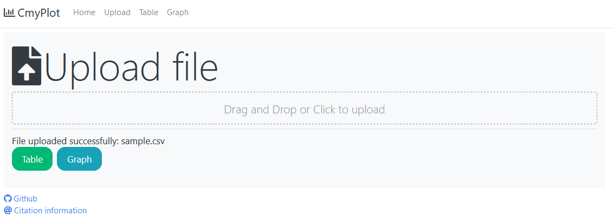
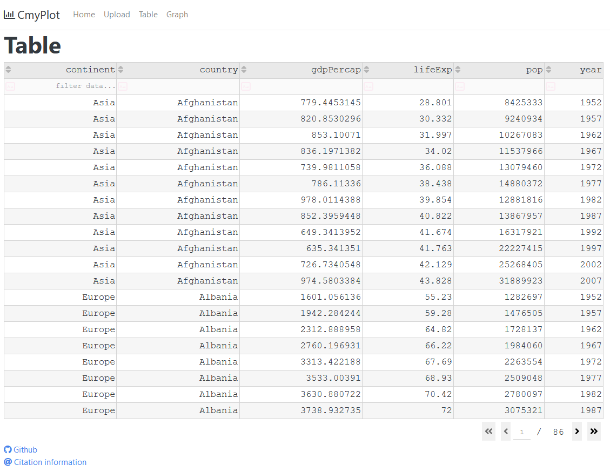
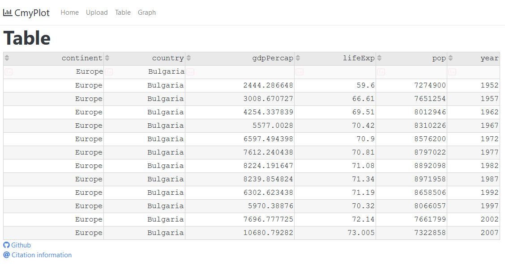

# CmyPlot  
**Data Visualisation Web App** 

## Why Data Visualization?

With enormous data in hand you would always want to visualize it for good understanding and better clarity with minimal efforts. 

As the famous saying goes - `"The greatest value of visualization is when it forces us to notice what we never expected to see"` - John W. Tukey

`CmyPlot` is a web app that provides interface for uploading a csv data file and convert it into Tables and interesting graphs with one click

- ## Built with

  
  
  

- **Language used:** Python
- **Libraries used:** Flask, Plotly, Dash
## Visual Walkthrough:
https://user-images.githubusercontent.com/65619749/134620802-5fac9f0e-d697-49df-876c-3f5ff7d86e38.mp4

## Quick look:

<table border="2" bordercolorlight="#b9dcff" bordercolordark="#006fdd">

  <tr style="background: #010203 ">
    <td valign="left"> 
      
 1.This is the main Cmyplot web page 
      

      
    </td>
    <td valign="left"> 
      
 2.You have an option to upload your csv file 
        by Drag and drop or click
      

      
    </td>
  </tr>
  
  <tr style="background: #010203;"> 
    <td valign="left">
      
 3.Once the file is uploaded, you can choose
         to visulaize using either table or graph
      
  
      
    </td>
    <td valign="left"> 
      
 4.For table, you could use 
      filters to sort the data as you want
      

      
    </td>

  </tr> 
  
  <tr style="background: #010203;"> 
    <td valign="left">
     
 5.Table representation of the data
      

      
    </td> 
    <td valign="left">
     
 6.Graph representation of the data
      

      
    </td> 
  </tr> 

  <!-- <tr style="background: #010203;"> 
    <td valign = "center">
      
    </td>
    
  </tr>  -->
 </table>
   
## Getting started:

  - ### Prerequisite:
      - Download [Python3.x](https://www.python.org/downloads/) on your system.

   - ### Installation:
      E.g If you downloaded `Python 3.9.7` above, then

      **Steps to setup virtual environment**
     - Create a virtual environment:

        `python3.9 -m venv project1_env`
    
     - Activate the virtual environment: 

        `source project1_env/bin/activate`
    
     - Build the virtual environment:(must be present in project directory)

        `pip install -r requirements.txt`

  - ### Run Instructions

     **To run/test the site locally:**

     - Clone [this (CmyPlot) github repo](https://github.com/bradley-erickson/CmyPlot).

     - Navigate to [project directory](./).

     - Create a virtual environment:

        `python -m venv project1_env`
    
     - Activate the virtual environment: 

        `source project1_env/bin/activate`
    
     - Build the virtual environment:

        `pip install -r requirements.txt`
  
     - Run:
     
        `python src/plotting/index.py`

     - Site will be hosted at:
       `http://127.0.0.1:8085/`

     ## Roadmap
       - [List of Roadmap and their corresponding open issues](https://github.com/bradley-erickson/CmyPlot/issues/48)
## Team Members
[Bradley Erickson](https://github.com/bradley-erickson)

[Aakriti Aakriti](https://github.com/aakriti0fnu)

[Sharath Kumar](https://github.com/sharathKV)

[AshwinKumarMuniswamy](https://github.com/AshwinKumarMuniswamy)

[Jainam Shah](https://github.com/j-08-shah)

