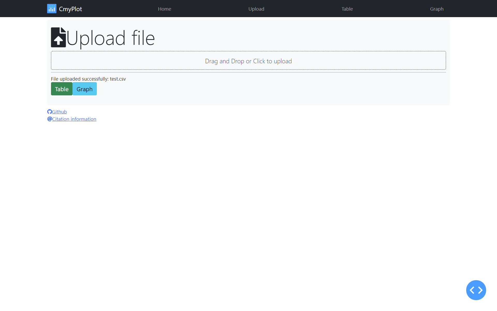

# CmyPlot  
**Data Visualisation Web App** 

## Why Data Visualization?

With enormous data in hand you would always want to visualize it for good understanding and better clarity with minimal efforts. 

As the famous saying goes - `"The greatest value of visualization is when it forces us to notice what we never expected to see"` - John W. Tukey

`CmyPlot` is a web app that provides interface for uploading a csv data file and convert it into Tables and interesting graphs with one click

- ## Built with

  
  
  

- **Language used:** Python
- **Libraries used:** Flask, Plotly, Dash
- **Development/ Debug Server:** Flask
- **Production Server:** Waitress
- **Deployment Platform:** Heroku   
**Note:** The application has been deployed on Heroku (free platform service). The app's usage is limited to monthly pool of free dyno hours. Also, free apps sleep automatically after 30 mins of inactivity to conserve your dyno hours.
## Visual Walkthrough:
https://user-images.githubusercontent.com/65619749/134620802-5fac9f0e-d697-49df-876c-3f5ff7d86e38.mp4

## Quick look:

<table border="2" bordercolorlight="#b9dcff" bordercolordark="#006fdd">

  <tr style="background: #010203 ">
    <td valign="left"> 
      
 1.This is the main Cmyplot web page 
      

      
    </td>
    <td valign="left"> 
      
 2.You have an option to upload your csv file 
        by Drag and drop or click
      

      
    </td>
  </tr>
  
  <tr style="background: #010203;"> 
    <td valign="left">
      
 3.Once the file is uploaded, you can choose
         to visualize using either table or graph
      
  
      
    </td>
    <td valign="left"> 
      
 4.For table, you could use 
      filters to sort the data as you want and select number of entries you want to display
      

      
    </td>

  </tr> 
  
  <tr style="background: #010203;"> 
    <td valign="left">
     
 5.Table representation of the data
      

      
    </td> 
    <td valign="left">
     
 6.Graph representation of the data. Here you get options to chose among multiple graph types and a sharable link to share or download the graph.
      

      
    </td> 
  </tr> 

  <!-- <tr style="background: #010203;"> 
    <td valign = "center">
      
    </td>
    
  </tr>  -->
 </table>
   
## Getting started:

  - ### Prerequisite:
      - Download [Python3.x](https://www.python.org/downloads/) on your system.

   - ### Installation:
      E.g If you downloaded `Python 3.9.7` above, then

      **Steps to setup virtual environment**
     - Create a virtual environment:

        `python3.9 -m venv project1_env`
    
     - Activate the virtual environment: 

        `source project1_env/bin/activate`
    
     - Build the virtual environment:(must be present in project directory)

        `pip install -r requirements.txt`

  - ### Run Instructions

     **To run/test the site locally:**

     - Clone [this (CmyPlot) github repo](https://github.com/bradley-erickson/CmyPlot).

     - Navigate to [project directory](./).

     - Create a virtual environment:

        `python -m venv project1_env`
    
     - Activate the virtual environment: 

        `source project1_env/bin/activate`
    
     - Build the virtual environment:

        `pip install -r requirements.txt`
  
     - Run:
     
        `python src/plotting/index.py`

     - Site will be hosted at:
       `http://127.0.0.1:8085/`

     ## Roadmap
       - [List of Roadmap and their corresponding open issues](https://github.com/bradley-erickson/CmyPlot/issues/48)

## Team Members
[Aditi Bhagwat](https://github.com/aditi12200)

[Anumit Garg](https://github.com/anumitgarg)

[Palvit Garg](https://github.com/palvitgarg99)

[Rachit Sharma](https://github.com/elric97)

[Shree Ramasubramanian](https://github.com/ShreeSub)

[Palvit Garg](https://github.com/palvitgarg99)

